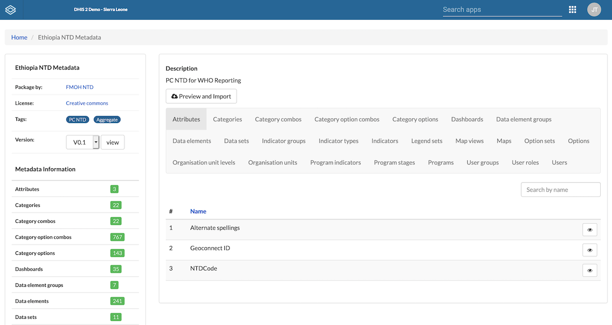

# NTD DHIS2 DB Metadata Repository

This is the metadata repository for the NTD database. The [metadata.json](metadata.json) file includes the all metadata for the NTD DHIS2 database including data elements, indicators, and organization units. To conveniently browse and import the metadata into your DHIS2 instance, consider using the [Metadata Repostiory app from HISP Tanzania](https://apps.dhis2.org/app/3c82dceb-5c50-49a3-8dc3-6bb6a30399f4). Here is how you can get started using this app:
1. Install the Metadata Repository app from the DHSI2 app store
2. Open the app and add [this url](https://raw.githubusercontent.com/ntddhis2/ntddb-metadata/master/index.json) as a metadata repository
3. Enjoy

